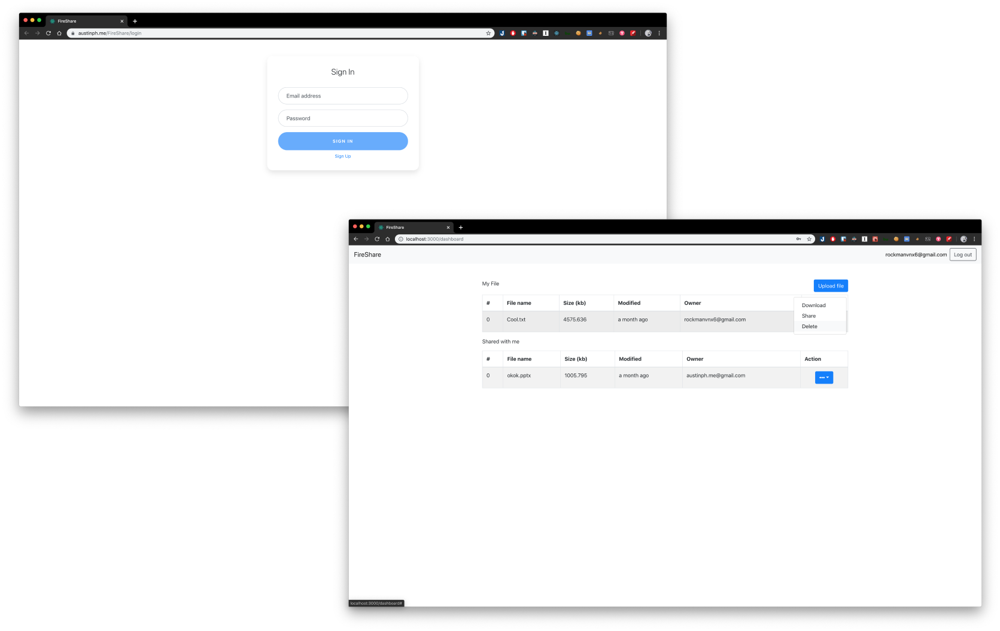
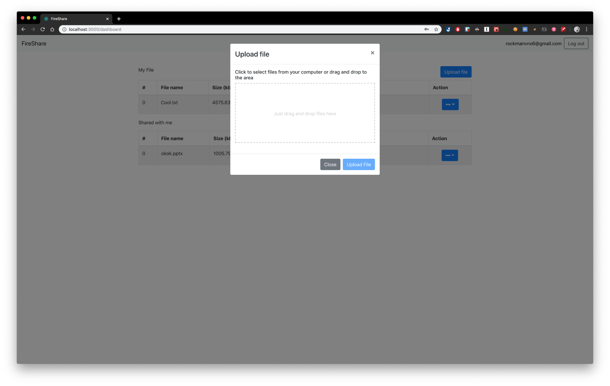
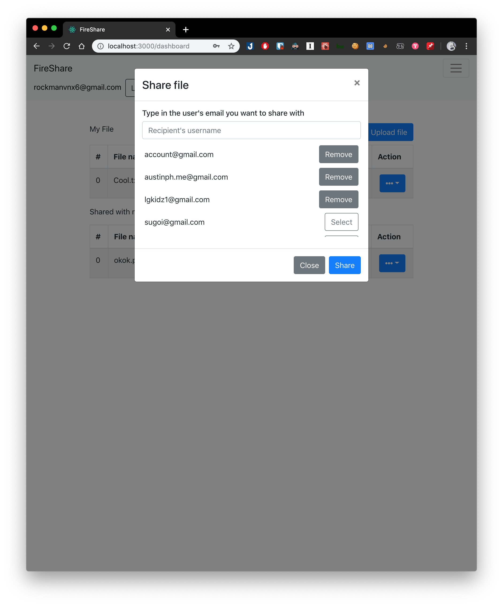
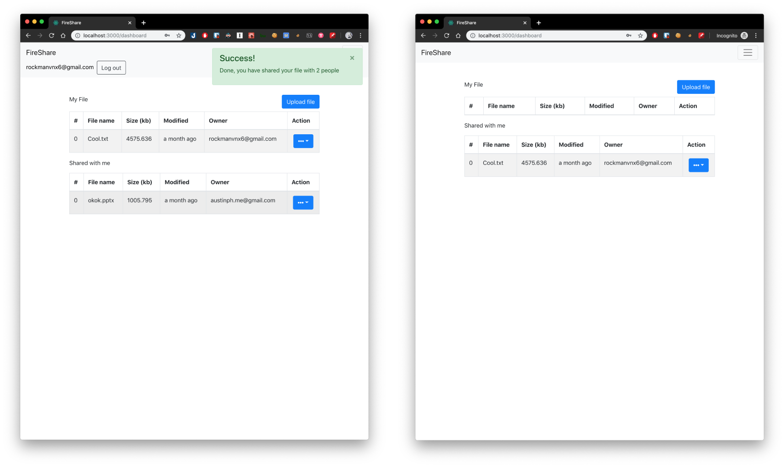

<p align="center">
  <a href="#"></a>
  <a href="https://auspham.dev/FireShare" target="_blank"></a>

# FireShare


A publish-subscribe real-tive file sharing system.

Live: https://auspham.dev/FireShare


## Technology used

- Backend: **NodeJS**, **Express**
- Database: **MongoDB Atlas** 
- FrontEnd: **ReactJS**
- Pub-Sub: **Socket.IO**
- Testing: 
  - Backend: **Mocha**, **Chai**, 
  - Frontend: **WebdriverIO**
- Cloud Hosting: **Heroku**,  **Github Page**.

## Demo









## Features

- Login, Register, Authentication using JWT Token.
- Database.
- Upload/Share/Unshare/Edit/Remove/Download file with other people - with Authentication
- Pub-sub model on file with real time update.


### What can user do?

1. User can create an account/register an account. To register, the email must not be used by any other user.
2. Owner can upload/share/delete his file with anyone who is in the system.
3. If owner shared with someone, owner can remove his file from sharing with that person, or choose not to share with anyone.
4. Owner can rename the file - **by clicking at the name of the file**.
5. User can see which file is shared with him, he can choose to unshare it if he wants.
6. User have real-time update on the file he subscribes (is shared/owned) to.
7. User can download if the file is shared to him or is owned by him. - Only user who has these privilege can download the file

## How to run

Go to backend, install and start the server

```bash
cd backend/
npm install && npm start
```

Server should be in `localhost:5000`. Please reserve this port for the application, else you can modify it in `Constants.js`, `backend/test/basic.js`


Go to frontend, install and start the server

```bash
cd frontend/
npm install && npm start
```

You can access the website in `localhost:3000` by default


### For testing:

Please leave both front-back end application on.

Frontend

```bash
cd frontend/
npm run test
```

> Your chrome browser’s version has to be 77 and above for the test to run.

Backend

```
cd backend/
npm run test
```


That’s it. Now enjoy the application running.
